# Databricks Certified Associate Developer for Apache Spark
## Simulado com 10 Questões + Mapa de Conteúdo

---

## Mapa do Exame — O que cai na prova

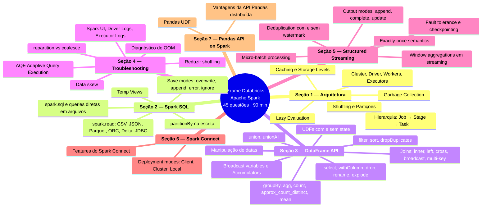

---

## Questão 1 — Write com partitionBy e overwrite

**Seção 2 — Spark SQL · Leitura e Escrita**

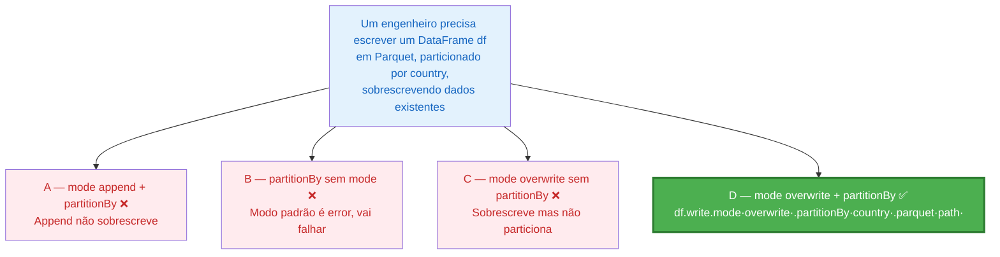

---

## Questão 2 — Onde encontrar Executor Logs

**Seção 4 — Troubleshooting · Logs e Monitoring**

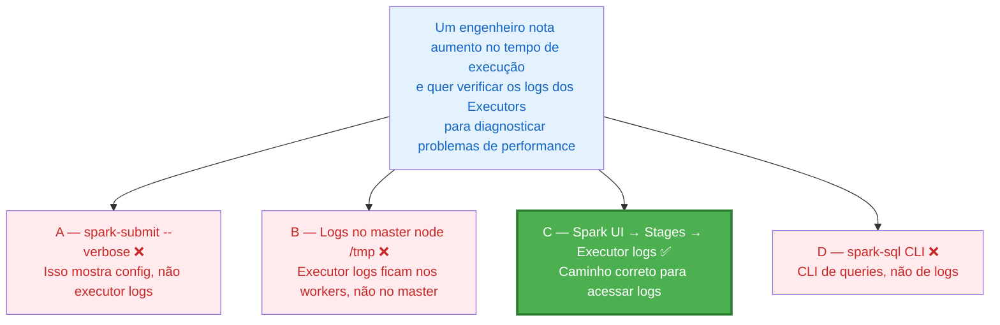

---

## Questão 3 — Renomear e substituir colunas

**Seção 3 — DataFrame API · Manipulação de Colunas**

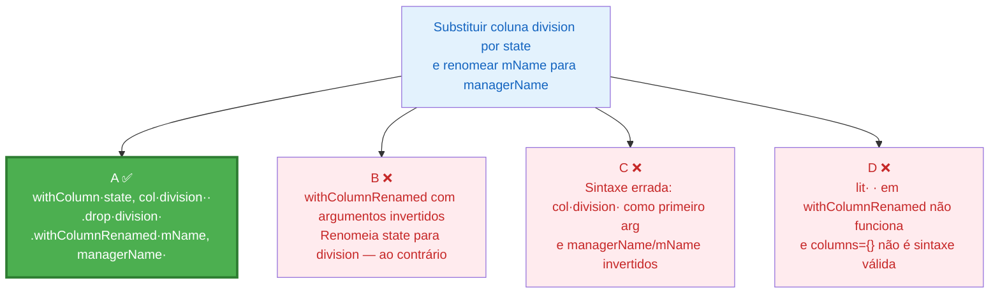

---

## Questão 4 — Sort, printSchema e conversão para lista

**Seção 3 — DataFrame API · Operações em DataFrames**

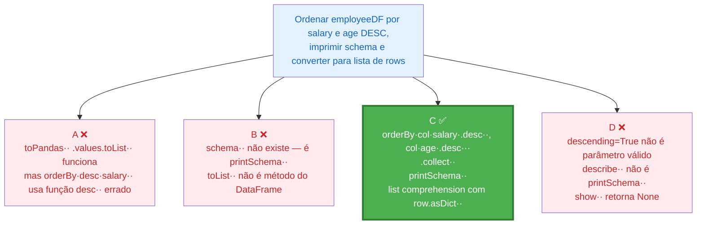

---

## Questão 5 — spark.sql.shuffle.partitions = 200

**Seção 1 — Arquitetura · Particionamento e Shuffling**

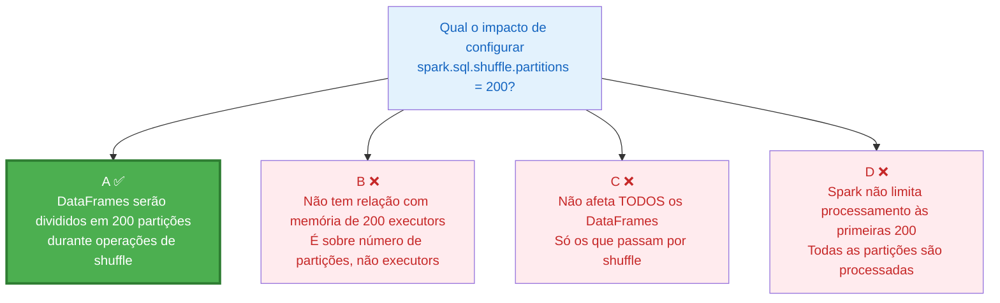

---

## Questão 6 — Remover linhas com valores missing

**Seção 3 — DataFrame API · Deduplicação e Validação**

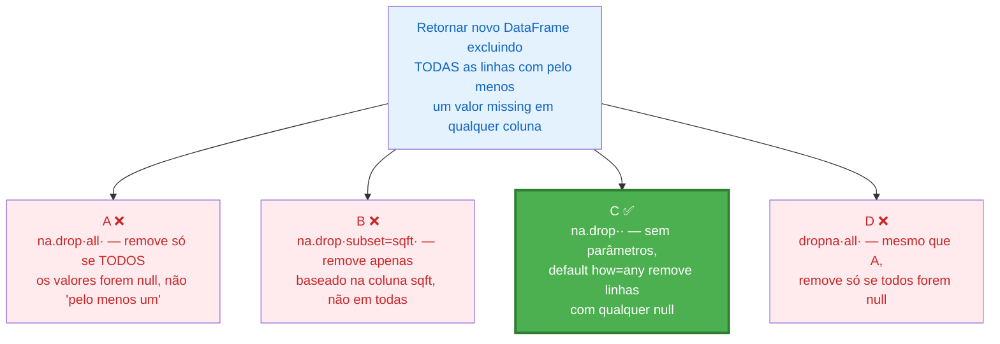

---

## Questão 7 — Deployment mode com single node

**Seção 6 — Spark Connect · Deployment Modes**

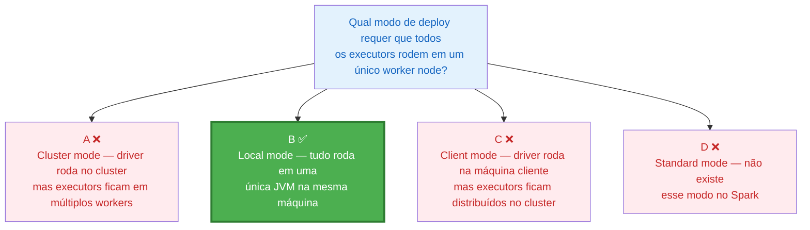

---

## Questão 8 — Streaming vs Batch DataFrames

**Seção 5 — Structured Streaming · Conceitos**

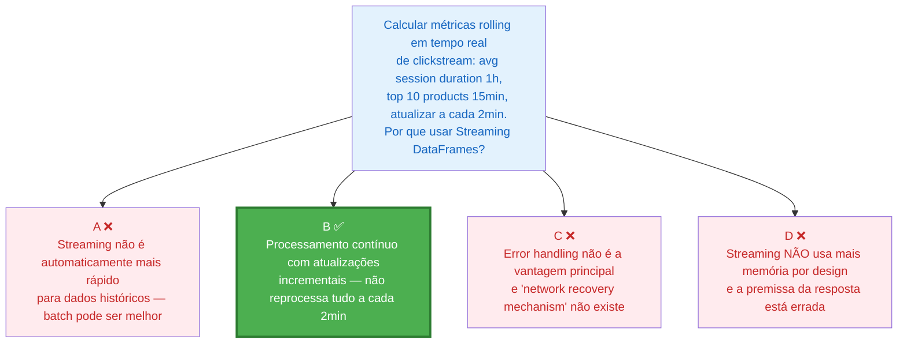

---

## Questão 9 — UDF sem stateful operators

**Seção 3 — DataFrame API · UDFs**

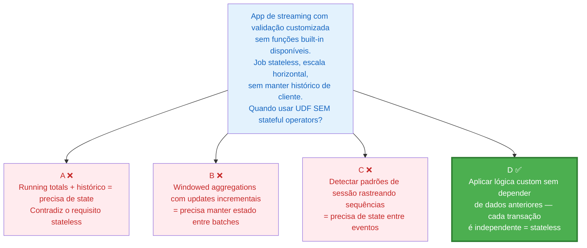

---

## Questão 10 — approx_count_distinct vs count(distinct)

**Seção 3 — DataFrame API · Agregações**

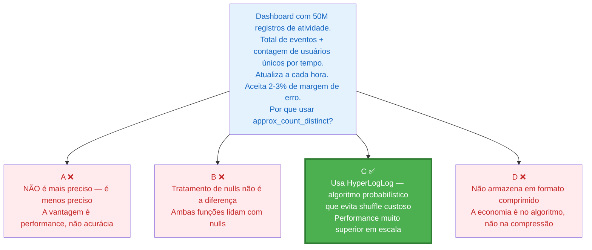

---

## Gabarito Rápido

```mermaid
flowchart LR
    Q1["Q1 → D"] --> Q2["Q2 → C"] --> Q3["Q3 → A"] --> Q4["Q4 → C"] --> Q5["Q5 → A"]
    Q5 --> Q6["Q6 → C"] --> Q7["Q7 → B"] --> Q8["Q8 → B"] --> Q9["Q9 → D"] --> Q10["Q10 → C"]

    style Q1 fill:#4caf50,color:#fff
    style Q2 fill:#4caf50,color:#fff
    style Q3 fill:#4caf50,color:#fff
    style Q4 fill:#4caf50,color:#fff
    style Q5 fill:#4caf50,color:#fff
    style Q6 fill:#4caf50,color:#fff
    style Q7 fill:#4caf50,color:#fff
    style Q8 fill:#4caf50,color:#fff
    style Q9 fill:#4caf50,color:#fff
    style Q10 fill:#4caf50,color:#fff
```

---

*Simulado baseado no Exam Guide oficial — Databricks Certified Associate Developer for Apache Spark (Oct 2025)*